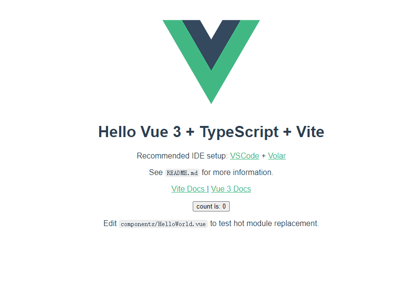

# Vue 3 + Typescript + Vite

vue3-vite2-ts4

```js
npm init @vitejs/app
vue
vue-ts
npm install
npm run dev
```



目录结构如下
​
```js
├── public              静态资源
├── src
│   ├── assets           资源目录（图片、less、css等）
│   ├── components       项目组件
│   ├── App.vue          主应用
│   ├── env.d.ts         全局声明
│   └── main.ts          主入口
├── .gitignore           git忽略配置
├── index.html           模板文件
├── package.json        依赖包/运行脚本配置文件
├── README.md
├── tsconfig.json        ts配置文件
├── tsconfig.node.json   ts配置文件
└── vite.config.ts       vite配置
```

每个目录的作用后文都会提及

```js
├── src
│   ├── router           路由配置
│   ├── stores           状态管理
│   ├── typings          ts公共类型
│   ├── utils            工具类函数封装
│   └── views            页面视图
```

指定解析路径使用的 path module需要先安装`@type/node`

```js
npm install @types/node --save-dev
```

打包功能

```js
build: {
      outDir: 'dist',   // 指定打包路径，默认为项目根目录下的 dist 目录
      terserOptions: {
          compress: {
              keep_infinity: true,  // 防止 Infinity 被压缩成 1/0，这可能会导致 Chrome 上的性能问题
              drop_console: true,   // 生产环境去除 console
              drop_debugger: true   // 生产环境去除 debugger
          },
      },
      chunkSizeWarningLimit: 1500   // chunk 大小警告的限制（以 kbs 为单位）
}
```

## 接入代码规范

ESlint 被称作下一代的 JS Linter 工具，能够将 JS 代码解析成 AST 抽象语法树，然后检测 AST 是否符合既定的规则。

```js
yarn add eslint @typescript-eslint/parser @typescript/eslint-plugin eslint-plugin-vue
```

TypeScirpt 官方决定全面采用 ESLint 作为代码检查的工具，并创建了一个新项目 typescript-eslint，提供了 TypeScript 文件的解析器 @typescript-eslint/parser 和相关的配置选项 @typescript-eslint/eslint-plugin 等

## 使用 scss 来增强 css 的语法能力

```js
yarn add sass
yarn add stylelint
yarn add stylelint-scss
```

## git hooks

```js
npm install --save-dev husky@4.3.8 lint-staged
```


